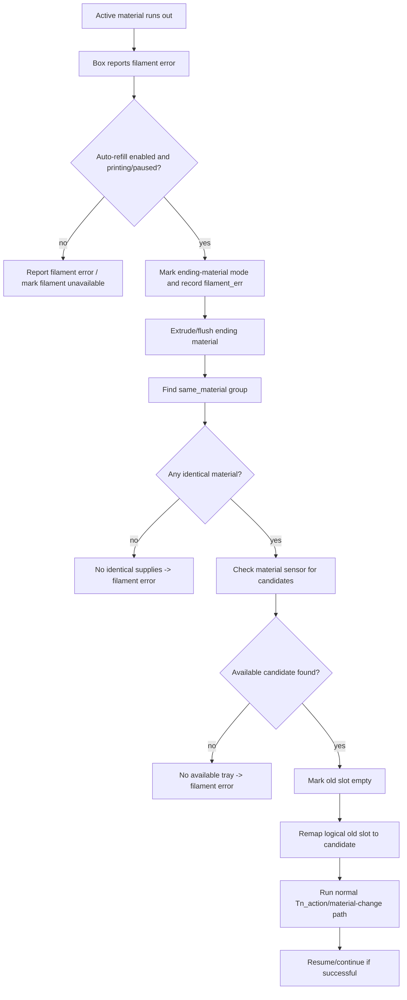

# Auto-refill behavior

## Scope

This document explains the material-box wrapper's automatic refill behavior: how
it detects compatible replacement material, how it remaps tools, how runout
interacts with ending-material flushing, and which commands are involved.

It is written for readers who do **not** have access to the source code.

For the state model behind `Tnn`, `Tnn_map`, `same_material`, and `last_cmd`, see
[`state-model.md`](state-model.md). For exact persisted remap/resume JSON and
macro-side mirror limitations, see
[`persistence-reference.md`](persistence-reference.md). For material-change
phases, see [`material-change-flow.md`](material-change-flow.md). For error and
retry behavior, see [`errors-and-recovery.md`](errors-and-recovery.md). For
command syntax, see [`klipper-macros.md`](klipper-macros.md).

## What auto-refill is meant to do

Auto-refill tries to keep a print going when the currently used material runs
out, by finding an available physical slot with the same material identity and
remapping the old logical slot to that replacement. In normal hardware state this
should be another slot. The compatibility behavior relies on live sensor
availability to decide whether a candidate slot can be used.

Conceptually:

```text
current logical material runs out
    -> identify its material_type and color_value
    -> find an available slot with the same material_type and color_value
    -> remap the old logical slot to the replacement physical slot
    -> continue/retry material loading through normal material-change recovery
```

Auto-refill depends on correct material identity and sensor state. It cannot
select a replacement if RFID/material identity is unknown or if no same-material
slot is physically available.

## What this means for a new wrapper

Auto-refill is mostly **wrapper policy**, not a special box-firmware feature. The
box provides primitives such as sensor queries, loading, retruding, and mode
changes. The wrapper decides when a runout should become a replacement search and
which slot to load next.

A new wrapper does not need to reproduce every compatibility branch. A practical
implementation needs only these user-visible guarantees:

```text
when active material runs out:
    identify what material was supposed to be printing
    find another physically-present slot with compatible material
    switch future use of the old logical material to that replacement
    load/flush the replacement through the normal material-change flow
    resume only after the path is safe and primed
```

Compatibility choices:

| Design choice | Old-wrapper-compatible approach | Simpler new-wrapper approach |
|---|---|---|
| Remember replacement | Persist `Tnn_map` so the old logical slot now points to the replacement physical slot. | Store your own mapping or job-local assignment in your wrapper state model. |
| Select replacement | Use `same_material` groups derived from material type and color, then require the material sensor bit. | Use any configured compatibility rule, but still require live sensor presence. |
| Handle filament already in the path | Run ending-material extrusion/flush before loading the replacement. | Pause for operator action or run a simpler, bounded purge policy. |
| Mark old slot empty | Update old wrapper slot identity fields such as `vender=none`. | Mark the old slot unavailable in your own runtime state and refresh RFID/sensors later. |
| Resume behavior | Use saved errors, `BOX_CHECK_MATERIAL_REFILL`, and `BOX_TNN_RETRY_PROCESS`. | Use a direct state machine: paused → unload/purge/load/flush → resume. |

For an independent wrapper, the essential safety rules are:

- do not select a replacement from cached JSON alone;
- require live material-present evidence for the replacement slot;
- keep the old logical tool mapped to the replacement for the rest of the job, or
  explicitly tell the slicer/operator which physical slot now represents it;
- make the purge/flush policy explicit before resuming printing.

## Important state

| State | Meaning |
|---|---|
| auto-refill enable flag | Runtime flag enabling/disabling auto-refill selection. |
| same-material groups | Derived groups of slots with matching material type and color. |
| active physical slot | Slot currently believed to be loaded. |
| previous active slot | Previous slot retained long enough for refill/recovery decisions. |
| remap table | Mapping used to redirect a logical slot to a replacement physical slot. |
| ending-material state | Marker that remaining filament in the path is being flushed/used after runout. |
| refill-in-progress state | Marker used while automatic replacement is being selected/loaded. |
| filament-error state | Marker that a box filament/runout path is active. |

See [`state-model.md`](state-model.md) for the state-machine view.

## User-facing commands

| Command | Purpose |
|---|---|
| `BOX_ENABLE_AUTO_REFILL ENABLE=<0\|1>` | Enable or disable the runtime auto-refill flag. Intended values are `0`/`1`; other values should be avoided. |
| `BOX_CHECK_MATERIAL_REFILL` | Continue/refire refill handling after a filament-error or ending-material state. |
| `WAIT_EXTRUSION_ALL_MATERIALS` | Wait until ending-material/auto-refill extrusion flows finish. |
| `BOX_EXTRUSION_ALL_MATERIALS` | Manually run the ending-material extrusion flow. |
| `BOX_MODIFY_TN ...` | Directly remap virtual/logical slots; auto-refill uses the same mapping mechanism. |
| `BOX_TNN_RETRY_PROCESS` | Main retry command after a refill/runout-related error has paused the print. |

## Enabling auto-refill

Runtime command:

```gcode
BOX_ENABLE_AUTO_REFILL ENABLE=1
```

Disable:

```gcode
BOX_ENABLE_AUTO_REFILL ENABLE=0
```

This controls the runtime auto-refill flag. Intended values are `0` and `1`.
It is separate from:

```gcode
BOX_ENABLE_CFS_PRINT ENABLE=<0|1>
```

`BOX_ENABLE_CFS_PRINT` controls whether the material-box/CFS system is enabled
for printing. Auto-refill only makes sense when box printing is enabled and the
wrapper has valid material identity data.

## Compatibility: `same_material`

Auto-refill chooses replacement slots from the derived `same_material` list.

A same-material group has this conceptual shape:

```text
material_type + color_value -> [physical slots]
```

Example:

```text
PLA red -> [T1A, T2C]
PETG black -> [T3B]
```

A slot can participate in a same-material group only when:

```text
vendor/RFID is not "none" or "-1"
material_type is not "-1", "none", or "unknown"
color_value is not "-1", "none", or "unknown"
```

So an inserted spool with unknown RFID cannot be selected as an auto-refill
replacement until its material type and color are known.

You can force recomputation with:

```gcode
BOX_UPDATE_SAME_MATERIAL_LIST
```

You can inspect state with:

```gcode
BOX_SHOW_TNN_INNER_DATA
```

## Replacement selection algorithm

When auto-refill runs for the current active material, it broadly does this:

```text
last = active physical slot
if auto_refill is disabled or last is unknown:
    mark global filament unavailable
    stop

read material_type and color_value for last
same_slots = same_material[material_type, color_value]

if same_slots is empty:
    report no identical supplies
    mark global filament unavailable
    record filament error
    stop

for candidate in same_slots:
    if candidate is not the exhausted slot and has material sensor present:
        remap old logical slot to candidate
        stop successfully

# Compatibility note: some wrapper paths rely mainly on the material sensor
# to reject the emptied old slot. Independent wrappers should explicitly
# exclude the exhausted slot unless there is a deliberate reason not to.

report no tray with ingredients found
mark global filament unavailable
record filament error
```

Two conditions must both be true:

1. the replacement must have the same material type and color;
2. the replacement must be physically available according to the box material
   sensor.

The same-material list can include the exhausted/current slot. Independent
wrappers should explicitly exclude the exhausted slot or otherwise prove with
live sensors that it is still a valid material supply.

## How remapping works

Auto-refill does not change the slicer's virtual tool command. Instead, it
changes the wrapper's mapping.

Example before refill:

```text
T0 -> T1A -> T1A
```

Suppose `T1A` runs out and `T2C` has the same material/color. Auto-refill changes
the mapping to:

```text
T0 -> T1A -> T2C
```

The slicer can continue issuing the same virtual/logical tool, but the wrapper
will use `T2C` as the actual physical supply slot.

The remap is performed through the same mechanism as:

```gcode
BOX_MODIFY_TN T1A=T2C
```

During auto-refill, the wrapper tracks that the remap is part of an automatic
replacement flow.

### Custom macro remap mirrors

The wrapper-managed `T*` material-change path reads the current remap table. A
custom macro that does not use the full `T*` path and calls lower-level commands must
handle remaps separately.

A config-only approach can mirror `BOX_MODIFY_TN` calls in macro variables. That
works for normal manual remaps and for auto-refill paths that issue
`BOX_MODIFY_TN`. It does not let the macro read the wrapper's persisted JSON
state.

Expected blind spots for a macro-side mirror:

| Situation | Why it can be missed |
|---|---|
| `BOX_POWER_LOSS_RESTORE` loads `tnn_map` | The wrapper can restore the persisted map without emitting `BOX_MODIFY_TN`. |
| restart with persisted resume state | Macro variables may start from config defaults while wrapper state is restored from persisted data. |
| manual edit of `creality/userdata/box/tn_data.json` | Plain Klipper macros do not parse that file. |

After those events, reissue the desired `BOX_MODIFY_TN ...` remaps or reset the
macro-side mirror intentionally before relying on a custom lower-level
material-change macro. See
[`persistence-reference.md`](persistence-reference.md#macro-side-remap-mirror-limitations)
for the full persistence/remap lifecycle.

## Runout trigger path

Auto-refill is usually entered after a box filament/runout response.

Conceptually:

```text
box reports FILAMENT_ERR / equivalent extrusion-empty state
    -> wrapper checks active material
    -> if auto_refill enabled and print is printing/paused:
           mark ending-material handling active
           record filament/runout recovery state with active material location
           return so ending-material/refill flow can continue
       else:
           report filament error
           mark global filament unavailable
```

The wrapper may also register a background tighten-up event to stabilize the box
path after filament error. That behavior is described in
[`errors-and-recovery.md`](errors-and-recovery.md#background-tighten-up-event).

## Ending-material flow

After runout, there may still be filament between the box, buffer, extruder, and
nozzle. The wrapper refers to this as using/flushing ending material.

One relevant manual command/workflow is:

```gcode
BOX_EXTRUSION_ALL_MATERIALS
```

The wrapper-managed `T*` material-change action and `BOX_CHECK_MATERIAL_REFILL`
can also continue ending-material/refill handling without the operator invoking
`BOX_EXTRUSION_ALL_MATERIALS` directly.

High-level behavior:

```text
if needed, raise/drop Z to a safe absolute height
heat to target material temperature
turn fan0 off and wait
repeat:
    move to extrude position
    extrude a chunk of material
    refresh connected box state
    wait for extrusion completion
    nozzle clean
    track total extruded length
    stop if local filament sensor has gone empty and then remained empty
    stop if max total extrusion limit is exceeded
```

Observed values used by this flow:

| Value | Meaning |
|---:|---|
| `80` | extrusion chunk length |
| `3000` | maximum total ending-material extrusion before giving up/succeeding as limit reached |
| `25` | safe absolute Z height used by this flow |

When ending-material extrusion succeeds, the wrapper clears/refines material
state and continues toward refill or retry behavior. The exact path depends on
whether the flow was started by a manual macro, a `T*` material-change action, or
`BOX_CHECK_MATERIAL_REFILL`.

## `BOX_CHECK_MATERIAL_REFILL`

This command resumes/refires parts of the refill handling state machine.

Syntax:

```gcode
BOX_CHECK_MATERIAL_REFILL
```

Broad behavior:

```text
if current saved error is filament_err and an address is known:
    set that box to IDLE
    clear saved error

if ending-material mode is active:
    clear ending-material flag
    disable filament_sensor_2
    schedule material_auto_refill
    stop

if box system is enabled:
    disable filament_sensor_2

in all non-ending-material cases:
    report/log no auto refill
```

This command is useful after the wrapper has entered a filament-error or
ending-material state and needs to continue automatic replacement selection.

## Successful auto-refill sequence

A typical successful refill sequence looks like this:

```text
1. Active material T1A runs out.
2. Box reports filament/runout error.
3. Wrapper records filament_err and marks ending-material mode.
4. Ending material is flushed/extruded from the toolhead path.
5. Auto-refill looks up material_type/color_value for T1A.
6. same_material contains [T1A, T2C].
7. Wrapper checks T2C material sensor and sees material available.
8. Wrapper marks old T1A vendor as none.
9. Wrapper remaps logical T1A to physical T2C:
       BOX_MODIFY_TN T1A=T2C
10. The remap invokes the normal `BOX_MODIFY_TN`/`Tn_action` material-change path.
11. If that path succeeds, the refill flow can trigger `RESUME` directly.
```

Mermaid overview:



## Failure outcomes

### No identical supplies

If no compatible material group exists for the active material:

```text
no matching material_type + color_value group
```

The wrapper:

- reports/logs `no identical supplies`;
- marks global filament unavailable;
- clears active material enough for refill handling;
- reports/records filament error for the old slot.

### No available tray

If compatible material exists in state but none of the compatible slots currently
has material sensor presence:

```text
same material exists, but no candidate is physically available
```

The wrapper:

- reports/logs `no tray with ingredients found`;
- marks global filament unavailable;
- reports/records filament error.

### Ending-material extrusion fails

If `BOX_EXTRUSION_ALL_MATERIALS` fails during auto-refill/ending-material
handling, the wrapper clears some transient errors and records a higher-level
extrusion-all-materials error for recovery.

The exact saved error depends on whether the flow was macro-driven or part of a
larger tool-change branch.

## Interaction with `BOX_TNN_RETRY_PROCESS`

`BOX_TNN_RETRY_PROCESS` is primarily for saved error recovery after a
filament/refill-related pause. A successful automatic remap may complete through
`BOX_MODIFY_TN`/`Tn_action` and resume directly without a separate retry command.

For `filament_err`, it broadly does this:

```text
wait while extrusion-all-materials or auto-refill flow is running
run filament recovery pipeline:
    set target box IDLE
    clear error
    box-extrude target material
    extruder-extrude target material
    flush material change
resume if recovery succeeded and print is paused
```

See [`errors-and-recovery.md`](errors-and-recovery.md#filament-error-recovery).

## Relationship to material-change flow

Auto-refill does not replace the normal material-change flow. It changes which
physical slot the normal flow will use.

```text
auto-refill responsibility:
    choose replacement slot
    update mapping
    mark old slot empty/unavailable

material-change responsibility:
    cut/retrude/load/flush/restore using the selected slot
```

This separation is why `Tnn_map` is central to refill behavior.

## Operational checklist

Before relying on auto-refill, verify:

1. **Auto-refill flag**
   - `BOX_ENABLE_AUTO_REFILL ENABLE=1`

2. **Box/CFS printing enabled**
   - `BOX_ENABLE_CFS_PRINT ENABLE=1`

3. **RFID/material identity known**
   - `BOX_GET_RFID ADDR=<box> NUM=<mask>`
   - `BOX_GET_REMAIN_LEN ADDR=<box> NUM=<mask>`
   - `BOX_UPDATE_SAME_MATERIAL_LIST`
   - `BOX_SHOW_TNN_INNER_DATA`

4. **Same-material groups exist**
   - active slot and replacement slot have the same `material_type` and
     `color_value`.

5. **Replacement material sensor present**
   - `BOX_GET_FILAMENT_SENSOR_STATE ADDR=<box> POSITION=MATERIAL`
   - replacement slot bit is set.

6. **Virtual mapping is understood**
   - know which logical slot the slicer will use;
   - inspect/remap with `BOX_MODIFY_TN` only if needed.

7. **Ending-material flow is safe**
   - extrude position, safe Y, hotend temperature, and fan behavior are
     calibrated.

## Troubleshooting

| Symptom | Likely cause | What to check |
|---|---|---|
| Auto-refill says no identical supplies | Missing or unknown RFID/material identity. | `BOX_GET_RFID`, `BOX_UPDATE_SAME_MATERIAL_LIST`, `BOX_SHOW_TNN_INNER_DATA`. |
| Compatible spool exists but is not selected | Material sensor for replacement slot is not present. | `BOX_GET_FILAMENT_SENSOR_STATE POSITION=MATERIAL`. |
| Wrong slot selected after refill | `Tnn_map` already remapped or stale. | Inspect mapping; reset with `BOX_MODIFY_TN` or end-print cleanup. |
| Print pauses but refill does not continue | Ending-material or auto-refill flow still running, or saved error not retried. | `WAIT_EXTRUSION_ALL_MATERIALS`, then `BOX_TNN_RETRY_PROCESS`. |
| Old empty slot still appears valid | Slot identity was not cleared or RFID state is stale. | Refresh RFID/material sensors; inspect `vender`, `material_type`, `color_value`. |
| Replacement loads but flush fails | Normal material-change issue after refill mapping. | See [`material-change-flow.md`](material-change-flow.md#flush-after-material-change) and recovery docs. |
| Auto-refill disabled unexpectedly | Runtime flag or CFS enable state changed. | `BOX_ENABLE_AUTO_REFILL ENABLE=1`, `BOX_ENABLE_CFS_PRINT ENABLE=1`. |

## Known caveats and uncertainties

| Area | Notes |
|---|---|
| Runtime-only auto-refill enable | `BOX_ENABLE_AUTO_REFILL` changes runtime state and is separate from persisted CFS print enable. Use `0` or `1`. |
| Identity quality | Auto-refill is only as good as RFID/material/color state. Unknown material cannot be matched. |
| Ending-material branch | Ending-material/refill sequencing is hardware-sensitive; validate on the target machine. |
| Old slot clearing | Auto-refill marks the old slot's vendor as `none`; external UI/tools should refresh same-material groups afterward. |
| Sensor dependence | A candidate with matching material identity is ignored if the material sensor bit is not present. |
| Mapping persistence | `BOX_MODIFY_TN` persists `Tnn_map`; power-loss restore can restore remaps. End-print cleanup may reset mappings. |
| Candidate self-selection | The same-material group may include the old slot; independent wrappers should explicitly exclude the exhausted slot or verify it with live sensors. |
| Concurrent refill flows | `WAIT_EXTRUSION_ALL_MATERIALS` exists because auto-refill and ending-material extrusion can run while other commands are waiting. |
