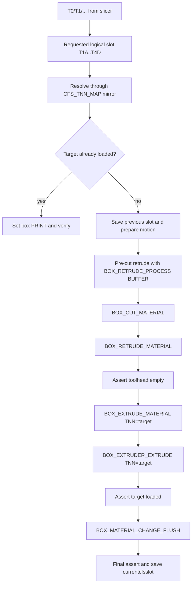

# Explicit wrapper-flush `box.cfg`

This note explains the experimental `box-explicit-wrapper-flush.cfg` profile.
It assumes you have the config and generated docs.

The profile is for this policy:

```text
controlled pre-cut retrude
-> wrapper cut
-> wrapper full retrude/unload
-> wrapper load
-> exactly one wrapper material-change flush
```

It intentionally does **not** call the wrapper-managed full `T0`/`T1` tool path
because that path hides the cut/retrude/load/flush order. Instead, it calls the
public lower-level material phases explicitly.

Related docs:

- [`configuration.md`](configuration.md) for `[box]` settings such as
  `Tn_extrude`, `nozzle_volume`, `flush_multiplier`, and positions.
- [`state-model.md`](state-model.md) for `Tn_map`, `Tnn_map`, `last_cmd`, and
  `tn_data.json`.
- [`klipper-macros.md`](klipper-macros.md) for the wrapper macro command
  meanings.
- [`material-change-flow.md`](material-change-flow.md) for the normal material
  phases.
- [`auto-refill.md`](auto-refill.md) for refill/remap behavior.
- [`errors-and-recovery.md`](errors-and-recovery.md) for retry/error concepts.

## Toolchange sequence

For example, `T0` maps to requested logical slot `T1A` and calls:

```gcode
CFS_SWAP_WRAPPER_FLUSH SLOT=T1A
```

The flow is:



Detailed order:

| Step | Command / check | Purpose |
|---:|---|---|
| 1 | Validate `SLOT=TnX` | Reject malformed targets. |
| 2 | Resolve through `CFS_TNN_MAP` | Honor macro-visible remaps from `BOX_MODIFY_TN`. |
| 3 | Check target box connected and no box is `PRELOADING` | Avoid starting during known unsafe state. |
| 4 | Read live `printer['box']['Tn']['filament']` | Determine the currently loaded slot from wrapper status. |
| 5 | Refuse stale fallback | If the toolhead sensor sees filament but wrapper status has no active slot, abort. |
| 6 | Same-slot fast path | If target is already loaded, set mode `PRINT`, verify, and skip cut/retrude/flush. |
| 7 | `CFS_PRE_CUT_RETRUDE` | Retrude before the cutter closes. |
| 8 | `BOX_CUT_MATERIAL` | Use the wrapper's cut phase. |
| 9 | `BOX_RETRUDE_MATERIAL` | Use the wrapper's full post-cut unload/retrude phase. |
| 10 | `CFS_ASSERT_TOOL_EMPTY` | Abort if the local filament sensor still sees filament. |
| 11 | `BOX_EXTRUDE_MATERIAL TNN=<target>` | Load target material from the selected box slot. |
| 12 | `BOX_EXTRUDER_EXTRUDE TNN=<target>` | Run wrapper printer-extruder-side load bookkeeping/action. |
| 13 | `CFS_ASSERT_SLOT_LOADED SAVE=0` | Verify before flushing. |
| 14 | `BOX_MATERIAL_CHANGE_FLUSH` | Run exactly one wrapper material-change flush. |
| 15 | `CFS_ASSERT_SLOT_LOADED SAVE=1` | Verify again and save `currentcfsslot`. |

## Flush control

This profile uses the wrapper's own flush command:

```gcode
BOX_MATERIAL_CHANGE_FLUSH LAST_TNN=<old> TNN=<target>
```

No custom purge follows it.

Flush length is controlled by `[box]` settings:

| Setting | Used when | Meaning |
|---|---|---|
| `Tn_extrude` | fallback/no-color path | Flush length when previous/target color data is missing or unusable. |
| `nozzle_volume` | color-based path | Extra nozzle volume added to the computed color-change volume. |
| `flush_multiplier` | color-based path | Multiplier applied to the computed color-based flush length. |

The profile uses:

```ini
Tn_extrude: 140
nozzle_volume: 164
flush_multiplier: 1
```

`nozzle_volume: 164` is a starting estimate. It assumes a target total pre-cut
retract of about `27 mm` before the cutter closes and subtracts the wrapper's own
wrapper-managed cutter retract of about `8 mm`. Tune this on hardware:

- increase `nozzle_volume` or `Tn_extrude` if color carryover remains;
- decrease them if purge is excessive.

## Pre-cut retract behavior

`CFS_PRE_CUT_RETRUDE` does a controlled retract before `BOX_CUT_MATERIAL`.

It only runs when:

- the local `filament_sensor_2` says filament is present;
- the current slot is known from live wrapper status;
- the current slot format is valid;
- the relevant box is not `PRELOADING`;
- `buffer_empty_len > 0`.

It sends:

```gcode
BOX_RETRUDE_PROCESS ADDR=<old-box> NUM=<old-slot> TRIGGER=BUFFER
G1 E-<matching-length>
```

in buffer-sized chunks. This is a low-level pre-cut movement, not the full unload.
The full unload happens after cutting via `BOX_RETRUDE_MATERIAL`.

## Active-slot tracking

The config intentionally does **not** trust `currentcfsslot` to decide which
buffer to drive.

It uses live wrapper status:

```text
printer['box']['T1']['filament']
printer['box']['T2']['filament']
printer['box']['T3']['filament']
printer['box']['T4']['filament']
```

If the toolhead sensor sees filament but wrapper status does not identify one
active slot, the macro aborts. This is safer than driving a guessed buffer.

`currentcfsslot` is only written after final verification. `previouscfsslot` is
kept as manual recovery context.

## Remap and auto-refill mirror

The wrapper has a mapping table usually described as `Tnn_map`.
Conceptually:

```text
T0 -> T1A -> actual physical slot
```

Auto-refill can remap the second step, for example:

```text
T1A -> T2C
```

The normal public remap command is:

```gcode
BOX_MODIFY_TN T1A=T2C
```

The explicit profile cannot directly read the wrapper's current mapping table.
Plain Klipper macros cannot open the wrapper's JSON state file or inspect Python
fields that are not exposed in `printer['box']`.

To handle normal remaps, the profile wraps `BOX_MODIFY_TN`:

```text
BOX_MODIFY_TN
  -> update macro-side CFS_TNN_MAP mirror
  -> pass the same command to the wrapper BOX_MODIFY_TN
```

Then `CFS_SWAP_WRAPPER_FLUSH SLOT=T1A` resolves through the macro mirror before
it calls lower-level load/flush commands.

### When the mirror is expected to work

| Situation | Expected result |
|---|---|
| Manual `BOX_MODIFY_TN T1A=T2C` after config load | Mirror updates. |
| Auto-refill emits `BOX_MODIFY_TN T1A=T2C` after config load | Mirror updates. |
| `BOX_END_PRINT` runs through this config | Mirror resets to identity. |

### When the mirror can be stale

The wrapper persists state under:

```text
creality/userdata/box/tn_data.json
```

That persisted state can include:

| Field | Meaning |
|---|---|
| `tnn_map` | Saved logical-to-physical remap table. |
| `last_cmd` | Saved active physical slot. |
| `enable` | Saved material-box enable state. |
| `base_data` | Long-lived slot material identity cache. |

The mirror can be stale when the wrapper loads or changes state without emitting
`BOX_MODIFY_TN`, especially:

| Situation | Why the macro can miss it | What to do |
|---|---|---|
| `BOX_POWER_LOSS_RESTORE` restores `tnn_map` | The wrapper can load `tnn_map` from `tn_data.json` directly into memory. | Reissue the needed `BOX_MODIFY_TN ...` so the macro mirror sees it, or run `CFS_RESET_TNN_MAP` if identity mapping is intended. |
| Restart plus `BOX_POWER_LOSS_RESTORE` or another startup/recovery flow that restores persisted remap state | The wrapper may load `tnn_map` from JSON directly while the macro mirror starts from configured defaults. | Reissue/remirror mappings before printing. |
| Someone edits `tn_data.json` manually | The macro has no file-reading path. | Reissue `BOX_MODIFY_TN ...` or reset intentionally. |
| Another command path changes mapping without `BOX_MODIFY_TN` | The mirror only observes `BOX_MODIFY_TN`. | Treat the mirror as stale until remapped/reset. |

This is the main auto-refill/remap limitation of a config-only solution.

## Error visibility limitation

The wrapper has recovery/error state that normal macros cannot directly read. This profile therefore uses visible checks:

- local toolhead filament sensor state;
- wrapper-reported active slot;
- target-slot verification before flush;
- target-slot verification after flush.

That catches many practical failures, but it is not the same as reading the exact
wrapper recovery state.

Also, `BOX_EXTRUDE_MATERIAL` should be followed by visible loaded-slot checks in
custom macros. Successful loads are not affected by this caveat.

## Hard-coded local filament sensor

The profile uses:

```text
filament_switch_sensor filament_sensor_2
```

That matches the wrapper behavior documented in
[`sensors-and-hardware.md`](sensors-and-hardware.md#local-printer-filament-sensor).
If your sensor name differs, update the config and verify wrapper paths that may
also assume `filament_sensor_2`.

## Validation checklist

Test with no print first.

Prerequisites:

- toolhead path clear;
- target box connected;
- no box in `PRELOADING`;
- current active slot visible in wrapper status if filament is present;
- hotend and cutter positions safe.

Suggested order:

1. `BOX_GET_BOX_STATE ADDR=1`
2. `BOX_GET_FILAMENT_SENSOR_STATE ADDR=1 POSITION=MATERIAL`
3. `BOX_GET_FILAMENT_SENSOR_STATE ADDR=1 POSITION=CONNECTIONS`
4. Test `CFS_PRE_CUT_RETRUDE CUR_SLOT=<actual-loaded-slot>` only when that slot
   is physically known to be loaded and the box is idle.
5. Test `CFS_SWAP_WRAPPER_FLUSH SLOT=<target>`. Start with a short, known-safe
   material pair.
6. Test slicer `T0`/`T1` wrappers after direct `CFS_SWAP_WRAPPER_FLUSH` works.
7. If using auto-refill/remap, test `BOX_MODIFY_TN T1A=T2C` and confirm the macro
   reports `requested=T1A resolved=T2C` during a swap.
