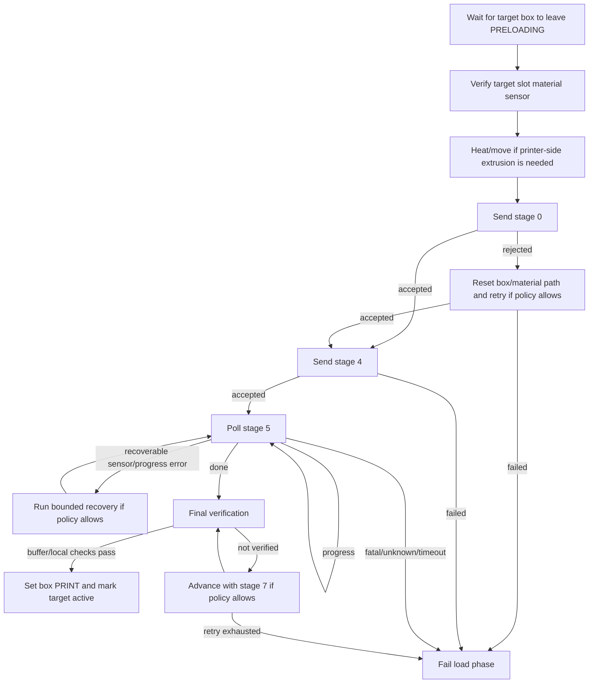

# `EXTRUDE_PROCESS` stages

## Scope

This document describes the observed `EXTRUDE_PROCESS` stage sequence used while
loading material from a box slot toward the printer. It is written as an
interoperability reference for users and independent wrapper authors.

For the full material-change sequence, see
[`material-change-flow.md`](material-change-flow.md). For packet shape, see
[`serial-protocol.md`](serial-protocol.md#extrude_process-data).

## Interpretation notes

- The stage value is a protocol byte inside the `EXTRUDE_PROCESS` request payload:

  ```text
  SLOT | STAGE | EXTRUDE_AMOUNT
  ```

  This makes the stage values observable on the serial interface during loading.
- Stage numbers are protocol enum values, not a consecutive step count. Missing
  numbers mean only that no useful compatibility role was observed.
- Human-readable names below describe observed behavior, not confirmed firmware
  terminology.
- Normal wrapper-managed loading uses stages `0`, `4`, `5`, and `7`; stage `6`
  is used during an advance/recovery event path. Stages `2` and `3` are not
  needed for the normal loading sequence described here.
- The public diagnostic macro `BOX_EXTRUDE_PROCESS` sends stage `2` for supported
  configurations. Treat that macro as a direct diagnostic command, not as the
  full wrapper-managed loading sequence.
- Some wrapper descriptions use the label "stage 8" for a final phase. In the
  observed command stream this is a wrapper-side final verification phase that
  sends stage `7` requests and checks buffer/local state.

## How the stage byte is used

`EXTRUDE_PROCESS` is one serial command id (`0x0d`) with a stage byte that selects
which part of loading the box should perform or report on. A normal load does not
send one command and wait for completion. It uses a staged exchange:

```text
stage 0  -> prepare/start loading for the selected slot
stage 4  -> begin the main material advance
stage 5  -> poll progress/result until done or failed
stage 7  -> advance during final buffer/local verification when needed
```

The wrapper decides when to move from one stage to the next based on command
responses and live sensor checks. For an independent wrapper, the relevance is:

- use stage values as protocol enum values, not as a loop counter;
- expect progress polling rather than a single blocking load command;
- stop on unknown/fatal response states instead of guessing;
- verify buffer/local filament state before marking the material loaded;
- treat stage `2` and stage `3` as diagnostic/reserved unless validated on the
  target hardware.

## Stage summary

| Stage | Compatibility role | When used | Expected observable result |
|---:|---|---|---|
| `0` | Start/reset loading for a selected slot. | Before staged loading and after reset-style recovery. | The box accepts the load start and the wrapper can proceed. |
| `2` | Public diagnostic macro stage. | Sent by `BOX_EXTRUDE_PROCESS` in supported configurations. | Useful for diagnostics only; not the normal managed load sequence. |
| `3` | Diagnostic/reserved retry stage. | Not part of the normal load sequence. | Treat as hardware validation needed before using. |
| `4` | Begin the main material advance. | After stage `0` succeeds. | Stage `5` polling can begin. |
| `5` | Poll loading progress/result. | During the main loading wait. | Continue, finish, or return an error state. |
| `6` | Advance/recovery acknowledgement. | During a specific advance/recovery event path. | Loading can continue or fail with a path/extrusion error. |
| `7` | Advance material during final verification. | After the main loading loop, while checking buffer/local state. | Buffer/local state eventually confirms loaded material. |
| wrapper-side final verification | Confirm material reached the expected path. | After stages `4`/`5` report completion. | Mark target loaded only after verification succeeds. |

## Normal staged loading flow



## Stage details

### Stage 0: start/reset

Send stage `0` after selecting the target slot, waiting for preloading to end,
checking material availability, and preparing temperature/motion as needed.

If stage `0` fails, an independent wrapper may safely choose to:

```text
set the target box to IDLE
retrude the target slot toward a known material-sensor position
send stage 0 again
stop if the retry fails
```

### Stage 2: public diagnostic macro default

Stage `2` is sent by the public `BOX_EXTRUDE_PROCESS` diagnostic macro for the
supported configurations documented here. It is not the normal wrapper-managed
load path. Use the higher-level loading commands for production material changes,
or validate stage `2` on hardware before relying on it directly.

### Stage 3: diagnostic/reserved

Stage `3` is not required for a functional normal loading sequence. Treat it as
reserved or diagnostic unless you have validated its hardware effect on the
target box.

### Stage 4: begin loading

Stage `4` starts the main material advance after stage `0` has prepared the slot.
If stage `4` is rejected, the safe behavior is to stop or restart from a known
state rather than continue polling.

### Stage 5: progress polling

Stage `5` is polled during loading. A wrapper should handle these result classes:

| Result class | Suggested behavior |
|---|---|
| Progress / still loading | Continue polling within a bounded timeout. |
| Done | Move to final verification. |
| Filament/sensor style error | Recheck local and box sensors; optionally run bounded recovery. |
| Joint/path error | Stop and require inspection or a specific recovery procedure. |
| Unknown error | Stop safely. |

The observed loading loop polls over roughly a minute-scale window. A new wrapper
should choose its own timeout based on hardware testing.

### Stage 6: advance/recovery acknowledgement

Stage `6` appears in an advance/recovery path during loading. For an independent
wrapper, it is enough to treat it as part of a bounded recovery strategy:

```text
if recovery event requires acknowledgement:
    send stage 6
    continue only if response is successful or explicitly recoverable
```

Do not depend on this path unless hardware validation shows your box needs it.

### Stage 7 and final verification

After stage `5` indicates completion, verify material arrival. The observed final
phase alternates printer-side advance, buffer/local checks, and stage `7` box
advance requests.

A safe independent-wrapper policy is:

```text
for a bounded number of attempts:
    query buffer/local state
    if loaded condition is confirmed:
        set target box to PRINT
        mark target active
        succeed
    advance material by a small calibrated amount
    send stage 7 if box-side advance is needed
fail if no loaded condition is confirmed
```

## Error categories and outcomes

| Condition | Practical outcome |
|---|---|
| Target slot material sensor missing before stage `0` | Material unavailable/runout. |
| Stage `0`, `4`, or `5` fails after bounded recovery | Box-load failure. |
| Loading completes but final verification never confirms material | Box-load failure. |
| Box loading succeeds but printer-side extrusion fails | Printer-extruder-side failure. |
| Load and printer-side extrusion succeed but purge/flush fails | Flush failure. |

Exact message text is not stable enough to use as the primary signal. Use phase,
response category, and observable sensor state.

## Remaining uncertainties

| Area | Uncertainty |
|---|---|
| Firmware stage names | Numeric stages are known, but firmware-side names are not confirmed. |
| Stage `2` | Public diagnostic macro default; not part of normal managed loading. |
| Stage `3` | Not required for normal loading; validate before use. |
| Stage `5` edge states | Unknown or unexpected states should stop safely. |
| Final verification naming | "Stage 8" is a wrapper-side phase name, not a confirmed transmitted stage byte. |
| Buffer-state polarity/name | Validate whether your hardware/status calls this full, ready, present, or triggered. |
