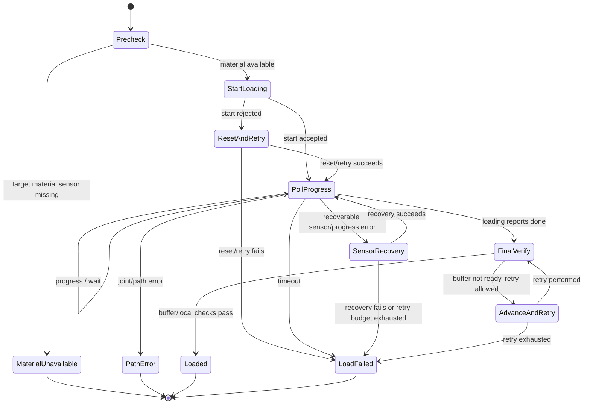

# Load failure recovery guide

## Scope

This document describes practical recovery behavior around loading material from
a box slot toward the printer. It is intended for operators and independent
wrapper authors. It does not prescribe exact retry counts; a new wrapper may use
its own bounded retry policy.

For stage-by-stage command behavior, see
[`extrude-process-stages.md`](extrude-process-stages.md). For full tool-change
error recovery, see [`errors-and-recovery.md`](errors-and-recovery.md).

## Recovery goals

A load failure usually means one of these externally visible conditions occurred:

| Condition | Typical response |
|---|---|
| Target slot has no material sensor bit | Stop and report material unavailable/runout. |
| Box rejected the start of loading | Reset the target box to `IDLE`, pull material back to a known sensor position, and retry loading once or with a bounded policy. |
| Loading starts but progress stalls | Recheck local/box sensors, loosen or reset material if safe, then retry loading. |
| Final buffer verification does not become ready/full | Nudge or advance material using a bounded policy, then stop if the buffer still does not confirm. |
| Joint/path error response | Stop and require operator inspection or a dedicated recovery path. |

A functional independent wrapper can choose simpler behavior than the original
wrapper, as long as it is explicit and safe:

```text
precheck sensors
start loading
poll loading progress
verify buffer/local filament state
if verification fails:
    stop or run a bounded recovery strategy
never loop indefinitely
```

## High-level recovery flow



## Precheck

Before sending staged load commands:

1. wait until the target box is not `PRELOADING`;
2. verify the target box is connected;
3. verify the target slot's material sensor bit is present;
4. move to a safe/load position if your workflow requires it;
5. heat to the chosen material-change temperature if printer extrusion will be
   involved.

If the target slot material bit is missing, do not try to load it. Report a
material-unavailable/runout condition.

## Start/reset recovery

The normal loading sequence starts with `EXTRUDE_PROCESS` stage `0`. If this
start command fails, a safe recovery policy is:

```text
set target box to IDLE
ask the box to retrude the target slot toward the material position
send stage 0 again
if that fails, stop and report load failure
```

A new wrapper may choose to attempt this once, several times, or not at all. The
important interoperability point is that resetting to `IDLE` and returning
material to a known sensor position is the safe recovery shape.

## Progress polling

After the start stage succeeds, the observed loading sequence sends stage `4` and
then polls stage `5` until progress completes, fails, or times out.

Useful public interpretation of stage-`5` results:

| Observed result class | Suggested independent-wrapper behavior |
|---|---|
| Progress / still loading | Continue polling until a bounded timeout. |
| Done / terminal success | Move to final verification. |
| Filament or sensor-style error | Recheck local and box sensors; optionally run a bounded sensor recovery. |
| Joint/path error | Stop and require inspection or a specific recovery step. |
| Unknown error | Stop safely rather than guessing. |

Do not rely on exact UI/log strings. Use response state categories, sensor state,
and the final loaded/buffer checks.

## Sensor recovery

For recoverable sensor/progress errors, a safe strategy is:

```text
set target box to IDLE if needed
loosen or retract material only within calibrated limits
recheck material and connection sensors
restart the staged loading sequence
```

This is wrapper policy. Independent implementations should make the retry budget
small, visible, and configurable rather than duplicating undocumented attempt
counts.

## Final verification

After the loading stage reports done, verify that material actually reached the
expected path.

Typical checks:

- local filament sensor present, if your machine has one;
- buffer state reports ready/full, if your workflow depends on buffer state;
- target slot is marked active/printing only after verification succeeds.

A practical final verification loop is:

```text
for a bounded number of attempts:
    if buffer/local checks pass:
        mark target loaded and set box PRINT
        succeed
    advance material by a small calibrated amount
    query buffer/local state again
fail if verification never passes
```

If the box reports a joint/path error during this phase, stop and inspect the
material path rather than continuing to push indefinitely.

## Mapping into higher-level errors

| Load result | Higher-level action |
|---|---|
| Target slot lacks material | Treat as material unavailable/runout. |
| Load fails after bounded recovery | Treat as box-load failure. |
| Box load succeeds but printer-side extrusion fails | Treat as printer-extruder-side failure. |
| Load and printer-side extrusion succeed but flush fails | Treat as flush failure. |

The exact error names used by a wrapper are policy. What matters for
interoperability is that each phase has a clear recovery boundary.

## Operational troubleshooting signals

| Signal | Likely phase |
|---|---|
| Immediate failure before progress polling | Precheck or start/reset. |
| Repeated load attempts without reaching buffer/local sensor | Progress polling or sensor recovery. |
| Reset to `IDLE` before another load attempt | Start/reset recovery. |
| Buffer never reports ready/full | Final verification. |
| Replacement slot reported empty | Material sensor precheck. |

## Independent-wrapper recommendations

- Use bounded retries only.
- Query live sensors before deciding that a slot is available.
- Treat buffer state as an immediate observation unless your wrapper owns a
  reliable cache.
- Separate box-side load failure from printer-extruder-side failure.
- Do not resume a print until the target material is verified and the purge/flush
  policy has completed.

## Remaining uncertainties

| Area | Uncertainty |
|---|---|
| Exact physical timing | Loading timing can vary by hardware, material, and firmware. Validate with the target box. |
| Firmware names for response states | Human-readable meanings are compatibility labels; use response categories and sensor observations. |
| Stage `3` | Treat as diagnostic/reserved unless validated for the target hardware. |
| User-facing messages | Message text may vary; phase and response category are more reliable than exact strings. |
