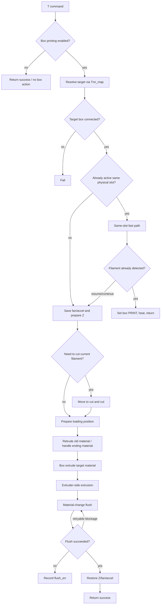

# Material change flow

## Scope

This document explains the high-level material-change workflow implemented by the
material-box wrapper. It is written for readers using public commands,
device-visible behavior, and deployed configuration.

It covers:

- the entrypoints that trigger material changes;
- how virtual tools resolve to physical box slots;
- the normal cut/retrude/load/flush/restore sequence;
- the major fast paths and special branches;
- how box loading and retruding work at a device-visible level;
- where failures become retryable errors.

For command syntax, see [`klipper-macros.md`](klipper-macros.md). For state
terms such as `Tnn`, `last_cmd`, and `Tnn_map`, see
[`state-model.md`](state-model.md). For error retry behavior, see
[`errors-and-recovery.md`](errors-and-recovery.md). For detailed unload/retrude,
cutter, buffer, and measuring-wheel behavior, see
[`unload-cutter-sensor-reference.md`](unload-cutter-sensor-reference.md).

## Main concepts

| Term | Meaning |
|---|---|
| virtual tool | User-facing `T0`..`T15` command. |
| physical slot / `Tnn` | A box slot such as `T1A` or `T4D`. |
| active material | The physical slot currently believed to be loaded into the printer path. |
| `last_cmd` | The active physical slot. |
| previous active slot | Previously active physical slot saved during transitions. |
| target material | The physical slot requested by the current tool/material command. |
| ending material | Remaining filament already in the path after runout or cut. |

## Entrypoints

These commands can start part or all of a material-change flow.

| Entrypoint | What it does |
|---|---|
| `T0`..`T15` | Full virtual tool material-change action. |
| `T1A`..`T4D` | Full physical-slot material-change action. |
| `BOX_EXTRUDE_MATERIAL TNN=<Tnn>` | Load/extrude material from the selected box slot. Always pass an explicit `TNN`. |
| `BOX_RETRUDE_MATERIAL` | Retrude/unload the currently active material. |
| `BOX_RETRUDE_MATERIAL_WITH_TNN [TNN=<Tnn>]` | Manually retrude a specific slot or unspecified detected material. |
| `BOX_EXTRUDER_EXTRUDE [TNN=<Tnn>]` | Run the printer-extruder-side extrusion action/bookkeeping. |
| `BOX_MATERIAL_CHANGE_FLUSH [LAST_TNN=<Tnn>] [TNN=<Tnn>]` | Flush after a material change. |
| `BOX_MATERIAL_FLUSH ...` | Direct flush/extrusion command, followed by nozzle cleaning. |
| `BOX_EXTRUSION_ALL_MATERIALS` | Extrude ending/remnant material until sensor/limit conditions are met. |
| `BOX_RESUME_EXTRUDE` | Special resume path when the same material should be re-primed after resume. |

The `T*` commands are the main full material-change entrypoints.

## Virtual tool resolution

A virtual tool command resolves in two steps:

```text
T0..T15 command
    -> default physical slot from Tn_map
    -> actual physical slot from Tnn_map
```

Example:

```text
T0 -> T1A -> T1A       normal identity mapping
T0 -> T1A -> T2C       after auto-refill/remap
```

A physical command such as `T2C` skips the `Tn_map` lookup but still passes
through the mutable `Tnn_map` layer.

If the resolved target box is not connected, the material-change action stops.

## Full tool-change overview

The normal intended flow is:

```text
resolve target material
validate box is enabled and connected
handle same-material fast paths
save fan and printer motion state
prepare toolhead / Z / safe position
cut current filament if needed
handle ending material if present
retrude old material
load target material from box and mark it active
run printer-extruder-side extrusion bookkeeping/action
flush from old material to new material
restore fan, Z, extrusion mode, and acceleration
```

Mermaid overview:



## Early exits and fast paths

### Box printing disabled

If the material-box/CFS enable flag is `0`, a `T*` command returns success
without performing box material-change work.

Use this when printing without the material box.

### No aggregate box connection

If no material box is connected, a `T*` command fails rather than trying to move
or load material.

### Target box disconnected

If the resolved physical target slot belongs to a disconnected box, the command
fails.

### Same active physical slot

If the requested material resolves to the same physical slot as the current
active material, the wrapper can take a fast path.

Common fast path:

```text
if target physical slot == active physical slot:
    if no saved error exists, or the saved error is filament_err:
        if local filament sensor detects filament:
            set box mode PRINT for that slot
            heat to target material temperature
            return success
```

Resume/continue-print variant:

```text
if same slot and continue-print flag is set:
    move/raise Z as needed
    go to extrude position
    set box mode PRINT
    extrude configured amount
    nozzle clean
    move safe
    restore Z
    clear continue-print flag
    return success
```

## Preparation phase

Before a full material change, the wrapper prepares printer and box state.

Typical actions:

```text
save current printer velocity/acceleration
turn off model fan if configured
if hotend can extrude:
    retract a small amount
move Z up slightly
record Z move for later restore
```

It may also move to safe or extrude positions depending on current toolhead Y and
configuration. Position settings are documented in
[`configuration.md`](configuration.md#extrude-clean-safe-and-retrude-positions).

## Cutting phase

The wrapper cuts current filament when there is active material or when the local
filament sensor reports filament present.

Conceptually:

```text
if active material exists or local filament sensor sees filament:
    move to cutter path
    perform cut strokes
    if cut sensor exists:
        require cut sensor confirmation
    if cut fails:
        record/return cut failure
```

Cut sensor behavior and calibration commands are documented in
[`sensors-and-hardware.md`](sensors-and-hardware.md#cutter--cut-sensor), with
full cutter path details in
[`unload-cutter-sensor-reference.md`](unload-cutter-sensor-reference.md#cutter-path-behavior).

Failure from the cut phase usually becomes `cut_err` or a tool-action failure
associated with the original virtual tool.

## Ending-material branch

The wrapper has special handling for material that remains in the toolhead/path
after runout or cut. This document calls it ending-material handling.

The broad intent is:

```text
if ending material needs to be flushed:
    disable secondary filament sensor
    extrude remaining material until sensor/limit conditions are satisfied
    clear old material identity if appropriate
    clear ending-material flags
```

The command/workflow involved is:

```text
BOX_EXTRUSION_ALL_MATERIALS
```

Compatibility caveat: ending-material handling can be entered from more than one
material-change branch. Independent wrappers should make this a clear state:
only one ending-material purge should run at a time, and normal loading should
not resume until that purge has either completed or been cancelled safely.

## Retrude old material

Detailed branch-by-branch unload behavior is documented in
[`unload-cutter-sensor-reference.md`](unload-cutter-sensor-reference.md#unload--retrude-decision-tree).

Retruding means pulling old material back out of the printer/material path toward
the box.

The normal case is when `last_cmd` is known.

Conceptual flow:

```text
last = active physical slot
wait until its box leaves PRELOADING
set that box to IDLE
compute temperature/velocity profile for current material

if local filament sensor still sees filament:
    command box retrude to BUFFER
    optionally extrude/retract through nozzle path to assist unload
    retract printer extruder

command box retrude to MATERIAL
if success:
    remember previous active slot
    clear active material marker
    verify local filament sensor no longer sees filament
```

If local sensor state and box sensor state disagree, the wrapper enters recovery
branches that may:

- set the box back to `IDLE`;
- query buffer state;
- loosen material;
- retry buffer/material retrude;
- report retrude sensor errors.

If no active material is known, the wrapper uses sensor state to decide what to
retrude:

```text
if local filament sensor says no filament:
    for each connected box:
        read material and connection masks
        retrude any slot where both masks indicate material
else:
    search connected boxes for connection sensor hits
    retrude from buffer/material based on detected slot state
```

Failures in this phase become `retrude_err` in the full material-change workflow.

## Box extrude/load target material

Box extrusion loads the selected target material from the material box toward the
printer path.

High-level flow:

```text
wait for target box to leave PRELOADING
if manual/non-print state:
    disable tighten-up on connected boxes

move to extrude position if needed
verify target slot has material available
compute flush velocity and temperature profile
heat to target temperature

send box extrusion start command
if start fails:
    run connection retry

enable stage/loading filament sensor handling
disable heartbeat for the target box during loading
run staged box-extrude material process
re-enable heartbeat/sensor state

set box mode PRINT for target slot
mark target as active material
```

The target slot availability check uses the box material sensor mask. If the
slot's material bit is not present, the wrapper reports a filament/material
availability error and records `filament_err`.

### Staged loading process

Detailed stage and retry references are available in
[`extrude-process-stages.md`](extrude-process-stages.md) and
[`load-retry-state-machine.md`](load-retry-state-machine.md).

The loading process is staged. Exact firmware meanings belong to the box
firmware, but observed compatibility behavior is:

```text
stage 0: start/connection setup
stage 4: begin material extrusion part
stage 5: poll loading progress
stage 6: advance/recover during a stage-7 related loading event
stage 7: final extrusion toward buffer-full detection
final verification: wrapper-side buffer/extruder verification phase
```

Conceptual staged flow:

```text
send stage 4
for up to about 90 seconds:
    poll stage 5 periodically
    handle stage-7 related advance/recovery result if one arrives
    if stage 5 reports a recoverable extrusion state:
        run corresponding bounded retry
    if loading reaches done condition:
        break

run final stage-8/buffer verification
if final verification fails:
    try extruder-gear retry once
```

### Load retries

Before exposing a box-load failure, the wrapper may try several bounded recovery
strategies.

| Retry type | Broad behavior |
|---|---|
| connection retry | Set box idle, retrude to material sensor, restart extrusion stage. |
| filament sensor retry | Move/loosen material, retry the material loading part. |
| second filament sensor retry | Reset connection path and retry again. |
| extruder gear retry | Cut/retrude/reposition, restart stage 0, and retry loading. |

If these retries fail, the outer material-change flow records a box-load failure.
See
[`load-retry-state-machine.md`](load-retry-state-machine.md) for retry decision
points and observable outcomes.

### Final buffer verification

The final loading phase repeatedly:

```text
extrudes with the printer extruder
waits briefly
checks buffer state
if buffer indicates success:
    return success
otherwise asks the box to advance material further
```

If the box reports a joint/advance issue, the wrapper may try several small
printer-extruder nudges before failing.

## Printer-extruder-side extrusion

After the box says material is loaded, the wrapper runs a printer-extruder-side
step. Treat it as a separate material-change phase even if your wrapper uses a
simpler verification model.

Failure here becomes:

```text
extruder_extrude_err
```

and can be retried separately by the recovery system.

## Explicit lower-level toolchange sequences

The full `T0`..`T15` and `T1A`..`T4D` entrypoints run the wrapper's complete
material-change action, including its own flush phase. A custom macro that needs
an explicit order such as:

```text
pre-cut retrude
cut
full post-cut retrude/unload
load target
one controlled wrapper flush
```

should not call the full `T*` action and then add another flush. Instead, it must
compose lower-level phase commands and call `BOX_MATERIAL_CHANGE_FLUSH` exactly
where it wants the wrapper flush to occur.

That style can satisfy a strict sequence, but it changes the responsibility
boundary:

| Full `T*` action | Explicit lower-level sequence |
|---|---|
| Wrapper-managed `T*` path resolves `Tnn_map`. | Macro must pass the intended physical slot or maintain a remap mirror. |
| Wrapper owns phase sequencing. | Macro owns cut/retrude/load/flush order. |
| Wrapper-managed path handles phase return values. | Macro should add visible checks after critical phases. |
| Flush is part of the hidden full sequence. | Macro decides when to call `BOX_MATERIAL_CHANGE_FLUSH`. |

For macro command details, see
[`klipper-macros.md`](klipper-macros.md#composing-lower-level-material-phases).
For mapping visibility limits, see
[`state-model.md`](state-model.md#macro-visibility-of-tnn_map).

## Flush after material change

The flush phase purges old color/material from the nozzle path after loading the
new material.

High-level flow:

```text
flush_len = choose flush length
flush_velocity, flush_percent = choose velocity profile
target_temp = max(last material temp, current material temp)
heat to target_temp
extrude/flush at configured profile
move to safe Y
restore current material target temperature
```

### Flush length selection

The wrapper can derive flush length from material color values.

Conceptually:

```text
if there was no previous material:
    use configured Tn_extrude length
else if color values are missing/unknown:
    use configured Tn_extrude length
else:
    compute color-based flushing volume
    add nozzle_volume
    convert volume to filament length
    multiply by flush_multiplier
```

Configuration settings:

- `Tn_extrude`
- `nozzle_volume`
- `flush_multiplier`

See [`configuration.md`](configuration.md#material-flow-and-flush-options).

The wrapper also has logic related to slicer-provided flush parameters, but exact
use of those values should be validated on target firmware.

### Flush velocity and temperature

Velocity:

```text
if material database has max volumetric speeds for both materials:
    use current material speed * 60
else:
    use configured Tn_extrude_velocity and Tn_extrude_percent
```

Temperature:

```text
flush_temp = max(previous material target temp, current material target temp)
restore_temp = current material target temp
```

Material database lookups use material ids derived from the saved material type.

### Segmented flush and blockage detection

For longer flushes tied to a target box slot, the wrapper may split flushing into
segments and use the measuring wheel to detect abnormal movement.

Conceptually:

```text
read measuring wheel
split total flush length into configured segments
for each segment:
    move to extrude position
    extrude segment
    read measuring wheel
    accumulate movement delta
    retract slightly
    handle box error if ending-material mode is active

if accumulated delta > diff_length:
    report nozzle blocked
    fail flush
```

Flush segmentation settings:

- `box_first_clean_length`
- `box_need_clean_length`
- `box_need_clean_length_max`
- `buffer_empty_len`
- `diff_length`

### Flush retry loop in full tool changes

The full `T*` material-change action retries flush in a narrow case.

Observed compatibility behavior:

- the flow can attempt the material-change flush up to three times;
- a successful flush ends the retry loop immediately;
- only a nozzle-blocked error or similar is treated as retryable;
- before each retry, the toolhead is moved through the safe/extrude-position
  path again;
- if the final attempt still fails, the workflow records a final `flush_err`.

Other flush failures are not treated as this narrow nozzle-blockage retry case.

## Restore and completion phase

After successful loading and flushing, the wrapper restores printer state.

Typical actions:

```text
if prime-tower path was active:
    restore fan

if hotend can extrude:
    prime a small amount

restore saved Z movement
record zero pending material-change Z move
reset extruder coordinate with G92 E0
set absolute positioning with G90
restore saved printer acceleration/feed state
wait for motion completion

if auto-refill flag was set:
    clear flag
    resume print
```

The target physical material is considered active after successful box extrusion,
before printer-extruder-side extrusion and final flush complete. If later flush
fails, recovery uses the saved error location to decide how to retry.

## Prime tower / slicer metadata branch

The wrapper can query slicer metadata for prime-tower purge support.

It only considers prime-tower purge when:

- print state is `printing`;
- virtual SD metadata exists;
- first-Tnn phase has finished;
- slicer is `CREALITY`;
- slicer version is at least `5.1.7.10471`;
- slicer flush parameters include `purge_in_prime_tower`.

When prime-tower purge is active, the wrapper changes some motion/fan behavior,
for example:

- it may avoid the usual material-loosening movement;
- it may raise Z to a larger absolute clearance;
- it may restore fan at a different point;
- it may move to safe Y differently after retrude.

Observed behavior uses slicer metadata to enable the prime-tower branch. Whether
the returned `purge_in_prime_tower` value directly becomes the flush amount
should be validated; flush length may still come from the wrapper's normal
flush-length logic.

## Resume extrusion path

`BOX_RESUME_EXTRUDE` is a dedicated path for resuming extrusion when the current
and resume material are the same physical slot.

High-level behavior:

```text
find resume target material from toolhead state or saved print metadata
verify target box is connected
verify last active material and resume target resolve to same physical slot
save current gcode speed
raise Z and move to extrude position
set box mode PRINT for target slot
heat to flush temperature
turn fan0 off temporarily
extrude configured flush amount
nozzle clean
restore fan0 if needed
move safe
small retract
restore Z
restore saved gcode speed
```

If the resume target is missing, disconnected, or not the same physical slot as
the last active material, the command fails or returns without doing the full
path.

## Where failures are recorded

| Phase | Typical saved error |
|---|---|
| cut | `cut_err` or original tool-action failure marker |
| retrude old material | `retrude_err` |
| load target material from box | `box_extrude_err` |
| printer-extruder-side step | `extruder_extrude_err` |
| flush | `flush_err` |
| target slot has no material | `filament_err` |
| speed/entanglement during print | `empty_print` |

Retry behavior is documented in
[`errors-and-recovery.md`](errors-and-recovery.md#box_tnn_retry_process).

## Practical troubleshooting by phase

| Symptom | Likely phase | Useful docs/commands |
|---|---|---|
| Target box not used | virtual mapping / connection | `BOX_SHOW_TNN_INNER_DATA`, `BOX_MODIFY_TN`, [`state-model.md`](state-model.md) |
| Material slot reported empty | availability check | `BOX_GET_FILAMENT_SENSOR_STATE POSITION=MATERIAL` |
| Material enters box path but does not reach buffer | box loading / buffer | `BOX_GET_BUFFER_STATE`, `BOX_EXTRUDE_PROCESS` diagnostics, loading config |
| Cut does not complete | cutting | `BOX_CUT_STATE`, `BOX_FIND_CUT_POS`, cutter config |
| Retrude leaves filament at toolhead sensor | retrude | `BOX_RETRUDE_MATERIAL`, local filament sensor validation |
| Flush repeatedly reports nozzle blocked | flush / measuring wheel | `BOX_MEASURING_WHEEL`, `diff_length`, flush segment settings |
| Same tool command still runs a large flow | active material state mismatch, local filament sensor not detected, or a pending non-filament error | inspect `last_cmd`, `Tnn_map`, local filament sensor, and saved error state |
| Resume command does nothing | resume target mismatch | `BOX_ADD_TNN`, saved resume metadata, active material state |

## Known caveats and uncertainties

| Area | Notes |
|---|---|
| Ending-material branch | Ending-material handling can be entered from multiple material-change branches. Validate sequencing on target firmware/hardware. |
| Cut failure recording | Treat exact saved error text for cut failures as uncertain; use phase and sensor state. |
| Slicer flush parameter use | The wrapper checks slicer/prime-tower metadata, but exact flush-length use should be validated. |
| `BOX_EXTRUDE_PROCESS` manual macro | It is a low-level/debug command and does not expose the full wrapper-managed staged loading behavior; see [`extrude-process-stages.md`](extrude-process-stages.md). |
| Measuring-wheel blockage threshold | Observed compatibility behavior treats `cumulative_diff > diff_length` as nozzle-blocked failure; hardware-specific sign/tuning should still be verified. |
| `extruder_extrude` phase | This phase is part of retry/error separation; independent wrappers may implement simpler verification if documented. |
